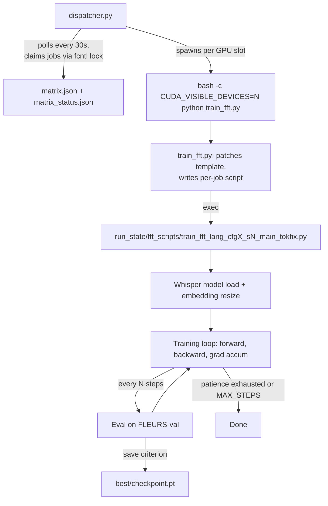

# Pipeline overview

From "job is in matrix.json" to "checkpoint saved to disk", here's the whole orchestration.

## Process tree

## The four layers

### 1. Dispatcher (`dispatcher.py`)

A long-lived Python process per pod that owns a GPU pool. Its job is to keep all GPUs busy with the next queued work:

- Reads `matrix.json` (the job list) and `matrix_status.json` (what's done/running/queued)
- Uses **fcntl-locked file claims** so the two pods don't claim the same job. The shared NFS mount (`/mnt/ssd-3`) is the coordination primitive — no Redis, Celery, or external scheduler. Just `flock(2)` on a `.lock` file.
- Polls every 30 seconds. When a GPU slot frees up, picks the first `queued` job that matches `--methods` filter and atomically writes `{state: running, pod, pid, started_at}`
- Spawns the worker as a subprocess with `CUDA_VISIBLE_DEVICES=N` + all the matrix args

The dispatcher is intentionally simple. Failure recovery is also simple — if a job exits with a nonzero code, the status is flipped to `failed` and the dispatcher claims the next queued job. There's no automatic retry; you re-queue manually after diagnosing.

### 2. Orchestrator (`train_fft.py`)

A thin Python script that's spawned once per job. Its job is to materialize a runnable training script from the per-lang template:

1. Reads `_pod_share/jobs/train_strategy_c_<lang>.py` (the template)
2. Text-substitutes a few lines: `SEED`, `OUTPUT_DIR`, `ASR_RATIO`, `EMBED_LR_MULT`, `DECODER_LR_MULT`, etc. (based on the matrix entry's cfg + the CLI args)
3. Writes the patched script to `run_state/fft_scripts/train_fft_<lang>_cfg<X>_s<N>_main_tokfix.py`
4. Calls `subprocess.call([python, that_script])` and waits

After the wait, the orchestrator just exits — there's no post-training work in `train_fft.py` itself.

The orchestrator pattern (vs. running the template directly) is what lets the same per-lang training code support both the experiment matrix and ad-hoc runs.

### 3. Per-job script

The patched template is the actual training program. Each lang has its own version with hard-coded constants for that language (FLEURS code, tokenizer path, goldfish corpus path). After the orchestrator's text substitution, the script is fully self-contained — you could run it directly without the dispatcher or `train_fft.py` involved.

This is also where divergence between paper text and deployed code lives. See [Findings → Paper-vs-code](../findings/paper-vs-code.md).

### 4. Evaluation + checkpoint

Periodic in-training eval drives both early stopping and best-ckpt selection. See [Pipeline → Eval + checkpoint mechanics](eval-checkpoint.md).

After training finishes, a *separate* test-time eval (`eval_strategy_c_test_combined.py`) loads the saved best ckpt and runs decoding on FLEURS-test + CV25-test.

## Why this architecture

| Design choice | Why |
|---|---|
| File-locked dispatcher, no DB | Two pods, shared NFS — adding a real broker would have been more complex than the gain |
| Per-lang template instead of generic train script | Templates carry language-specific tweaks that aren't worth generalizing (ext_dir paths, language-specific eval, etc.) |
| Text-substitution-based orchestrator | Trivially debuggable — the patched script is a real Python file you can re-run by hand |
| No retry on failure | Mostly recipe issues, not transient ones — better to fix the root cause |
| Single-criterion save (per Group) | Avoids choosing between multiple noisy signals; each group's criterion was empirically validated |

## Next pages

- [Dispatcher + matrix](dispatcher.md) — schema of `matrix.json`, how claims work
- [Per-job script generation](per-job-script.md) — exactly what `train_fft.py` patches
- [Training loop internals](training-loop.md) — model load, gradient accumulation, mixed precision
- [Eval + checkpoint mechanics](eval-checkpoint.md) — when checkpoints save, what's in them
